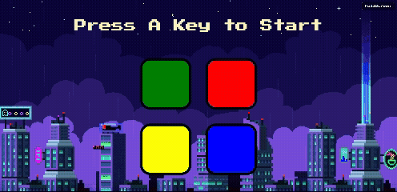

# 🟢 Simon Game 🎮

A web-based implementation of the classic **Simon Game** — a memory-based color sequence game built using **HTML**, **CSS**, and **JavaScript**.

## 🚀 Demo

[Click here to play the game](https://kanika0004.github.io/simon-game/)

## 📸 Preview

  
*(Replace with actual screenshot of your game if available)*

## 🧠 How to Play

1. Watch the sequence of flashing colors.
2. Repeat the sequence by clicking the colors in the correct order.
3. The game gets progressively harder as the sequence grows.
4. Make a mistake, and it's game over!

## 🛠️ Technologies Used

- HTML5
- CSS3
- JavaScript (Vanilla JS)

## 📦 Features

- Interactive and responsive UI
- Sound effects for each color
- Increasing difficulty with each level
- Game over alert and restart functionality

## 🎯 Future Improvements

- Add score tracking and high scores
- Difficulty levels (Easy, Medium, Hard)
- Mobile-friendly UI
- Animations/transitions for better UX

## 🧑‍💻 Author

**Kanika**  
[GitHub Profile](https://github.com/kanika0004)

## 📝 License

This project is licensed under the [MIT License](LICENSE).

---

Feel free to contribute or fork this project!

⭐ If you like this project, give it a star on GitHub!

